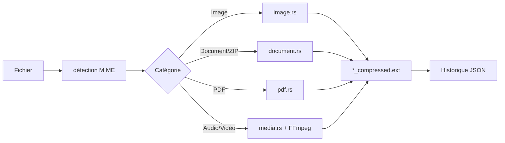

# cPress

Application desktop **open source** de compression de fichiers, entièrement locale — vos données ne quittent jamais votre machine.

**Site web :** [sergelacime.github.io/cpress/](https://sergelacime.github.io/cpress/)

Développée avec **Tauri 2**, **React** et **Rust** par [sergelacime](https://github.com/sergelacime).


---

## Fonctionnalités

- **Compression locale** — aucun envoi vers un serveur distant
- **Glisser-déposer** ou sélection de fichiers multiples
- **Curseur de qualité** (1–100) pour ajuster le compromis taille / fidélité
- **Aperçu intégré** — images, vidéo, audio, PDF et documents
- **Historique persistant** — dernières compressions enregistrées en JSON
- **Thème clair / sombre**
- **Révéler dans le Finder / Explorateur** en un clic sur un job terminé
- **Fichier de sortie intelligent** — conserve l'original si la recompression est plus lourde (images JPEG)

Les fichiers compressés sont créés **à côté de l'original** avec le suffixe `_compressed`  
(ex. `photo.jpg` → `photo_compressed.jpg`).

---

## Formats pris en charge

| Catégorie | Formats | Moteur |
|-----------|---------|--------|
| **Images** | JPEG, PNG, WebP | Rust (`image`, `oxipng`) |
| **Documents Office** | DOCX, XLSX, PPTX, ODT, ODS, ODP | Recompression ZIP + images internes |
| **Archives** | ZIP | Recompression + optimisation des entrées |
| **PDF** | PDF | `qpdf` (si disponible) ou `lopdf` (compression de flux) |
| **Vidéo** | MP4, MOV, MKV, … | FFmpeg (sidecar embarqué) |
| **Audio** | MP3, WAV, … | FFmpeg (sidecar embarqué) |

> **PDF** : si `qpdf` est installé sur le système (`brew install qpdf`), une compression plus agressive est utilisée. Sinon, cPress applique une compression de flux sûre via `lopdf` (sans altérer les images embarquées).

---

## Site web

Page de présentation en ligne : **[https://sergelacime.github.io/cpress/](https://sergelacime.github.io/cpress/)**

Les sources sont dans le dossier [`docs/`](docs/index.html). Hébergement via GitHub Pages (branche `main`, dossier `/docs`). Le fichier `docs/.nojekyll` désactive Jekyll pour servir les assets tels quels.

---

## Captures d'écran

<!-- Remplacez par vos captures une fois le dépôt publié -->
| Interface principale | Aperçu & historique |
|----------------------|---------------------|
| *À ajouter* | *À ajouter* |

---

## Prérequis

### Développement

| Outil | Version minimale |
|-------|------------------|
| [Node.js](https://nodejs.org/) | 18+ |
| [pnpm](https://pnpm.io/) | 8+ |
| [Rust](https://rustup.rs/) | stable (edition 2021) |
| Xcode Command Line Tools (macOS) | pour la compilation native |

### Optionnel

- **qpdf** — compression PDF avancée (`brew install qpdf` sur macOS)
- **FFmpeg** système — utilisé en secours si le sidecar embarqué est absent (dev)

---

## Installation & développement

```bash
git clone https://github.com/sergelacime/cpress.git
cd cpress
pnpm install
pnpm tauri dev
```

Au premier lancement en mode développement, FFmpeg est résolu via le sidecar ou le PATH système.

---

## Build de production

Le script `scripts/download-sidecars.sh` est exécuté automatiquement avant le build et télécharge **FFmpeg** pour la plateforme courante :

| Plateforme | Source FFmpeg |
|------------|---------------|
| macOS Apple Silicon | [osxexperts.net](https://www.osxexperts.net) |
| macOS Intel | [osxexperts.net](https://www.osxexperts.net) |
| Linux / Windows | [BtbN FFmpeg Builds](https://github.com/BtbN/FFmpeg-Builds) |

```bash
pnpm tauri build
```

Artefacts générés dans `src-tauri/target/release/bundle/` :

- **macOS** — `.app` et `.dmg`
- **Windows** — `.msi` / `.exe`
- **Linux** — `.deb`, `.AppImage`, etc.

Téléchargement manuel des sidecars (optionnel) :

```bash
bash scripts/download-sidecars.sh
```

---

## Architecture

```
cpress/
├── src/                    # Frontend React (TypeScript)
│   ├── components/         # JobCard, FilePreview, HistoryPanel, ThemeToggle
│   ├── hooks/              # useCompression, useHistory, useTheme
│   └── App.tsx
├── src-tauri/
│   ├── src/
│   │   ├── commands/       # image, document, pdf, media, sidecar
│   │   ├── detect.rs       # Détection MIME & catégorisation
│   │   ├── history.rs      # Persistance JSON (max 500 entrées)
│   │   └── progress.rs     # Événements de progression vers l'UI
│   ├── binaries/           # FFmpeg sidecar (gitignored, téléchargé au build)
│   └── tauri.conf.json
└── scripts/
    └── download-sidecars.sh
```

### Flux de compression



---

## Configuration

| Paramètre | Fichier | Description |
|-----------|---------|-------------|
| Identifiant app | `tauri.conf.json` | `com.cpress.desktop` |
| Qualité par défaut | Backend | 80 |
| Historique max | `history.rs` | 500 enregistrements |
| Emplacement historique | Dossier données app Tauri | `compression_history.json` |

---

## Scripts npm

| Commande | Description |
|----------|-------------|
| `pnpm dev` | Serveur Vite (frontend seul) |
| `pnpm tauri dev` | Application complète en mode dev |
| `pnpm build` | Build frontend |
| `pnpm tauri build` | Build production + sidecars + installeur |

---

## Licence & dépendances tierces

### cPress

Copyright © 2026 **sergelacime** — distribué sous licence [MIT](LICENSE).

### Binaires embarqués

- **FFmpeg** — licence LGPL 2.1+ (builds BtbN) ou GPL (builds osxexperts sur macOS). Vérifiez la licence du binaire téléchargé pour votre plateforme avant redistribution.
- **qpdf** (optionnel, non embarqué par défaut) — licence Apache 2.0

### Bibliothèques principales

| Composant | Licence |
|-----------|---------|
| Tauri 2 | MIT / Apache-2.0 |
| React | MIT |
| oxipng | MIT |
| lopdf | MIT |
| image (Rust) | MIT / Apache-2.0 |

---

## Contribution

Les contributions sont les bienvenues.

1. Forkez le dépôt
2. Créez une branche (`git checkout -b feat/ma-fonctionnalite`)
3. Committez vos changements
4. Ouvrez une Pull Request

Merci de respecter le style existant et de limiter la portée des PRs.

---

## Auteur

**sergelacime**

- Site : [sergelacime.github.io/cpress/](https://sergelacime.github.io/cpress/)
- GitHub : [@sergelacime](https://github.com/sergelacime)
- Projet : [github.com/sergelacime/cpress](https://github.com/sergelacime/cpress)

---

## Roadmap (idées)

- [ ] Compression par lot avec file d'attente parallèle
- [ ] Presets de qualité (Web, Print, Archivage)
- [ ] Support HEIC / AVIF
- [ ] CI GitHub Actions (build multi-plateforme)
- [ ] Releases automatiques avec binaires signés

---

## Dépannage

| Problème | Solution |
|----------|----------|
| Vidéo : « os error 2 » | Relancez `bash scripts/download-sidecars.sh` puis `pnpm tauri build` |
| PDF : 0 % d'économie | Normal sans `qpdf` ; installez-le pour une compression plus poussée |
| JPEG plus gros après compression | L'original est conservé automatiquement si le résultat est plus lourd |
| Build macOS échoue sur FFmpeg | Vérifiez la connectivité vers osxexperts.net ou BtbN |

---

<p align="center">
  <sub>© 2026 sergelacime — cPress</sub>
</p>
